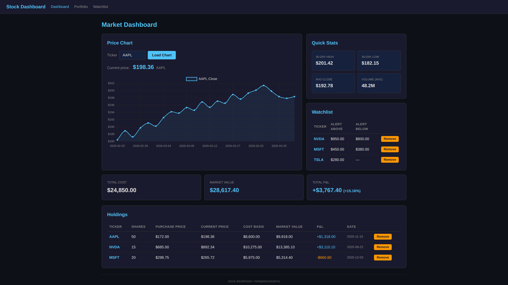

# Stock Dashboard

A Flask portfolio demo that tracks stock holdings and price history with an accessible dark-theme UI.

## Features

- **Price charts** powered by Chart.js — search any ticker for 30-day OHLCV history
- **Portfolio tracker** — add/remove holdings, live P&L vs. purchase price
- **Watchlist** — track tickers with optional price alerts
- **Demo mode** — bundled sample data (AAPL, NVDA, MSFT) requires no API key
- **Accessible dark theme** — blue/orange palette, no red/green (color-blind friendly)
- **REST API** — `/api/prices/<ticker>`, `/api/holdings`, `/api/watchlist`

## Install

```bash
pip install -r requirements.txt
```

## Usage

### Demo mode (no API key needed)

```bash
python app.py          # runs on http://localhost:5001
```

### Seed sample portfolio data

```bash
python seed_data.py
```

### Run tests

```bash
pytest tests/ -v
```

### Live mode (yfinance)

Edit `app.py` and change `create_app(demo_mode=False)` — yfinance will fetch real market data.

## Project Structure

```
stock-dashboard/
├── app.py                 # Flask factory + routes
├── data_source.py         # yfinance wrapper + sample fallback
├── db.py                  # SQLite schema (holdings, watchlist)
├── portfolio_tracker.py   # Portfolio CRUD + P&L calc
├── seed_data.py           # One-time DB seed script
├── sample_data/
│   └── prices.csv         # 30-day AAPL/NVDA/MSFT sample data
├── templates/
│   ├── base.html
│   ├── dashboard.html
│   ├── portfolio.html
│   └── watchlist.html
├── static/
│   ├── css/style.css
│   └── js/
│       ├── app.js
│       ├── charts.js
│       └── chart.min.js   # Chart.js 4.4.7 (vendored)
└── tests/
    ├── test_data_source.py
    ├── test_portfolio.py
    └── test_app.py
```

## Screenshot



---

Built with Flask · Chart.js · yfinance · SQLite
